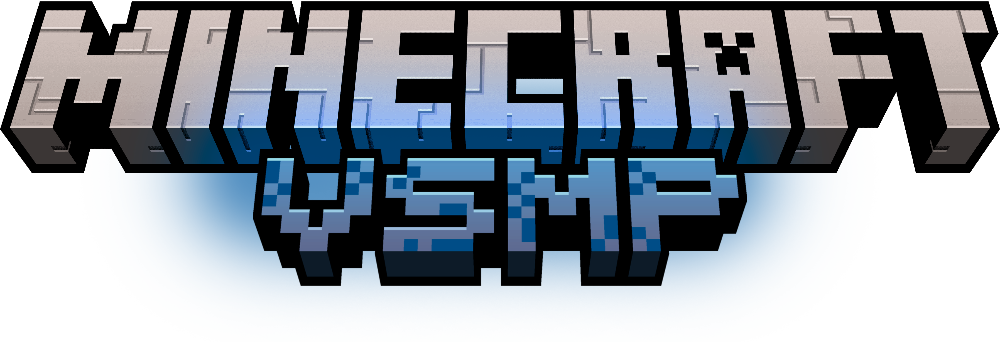

# Random Events

Welcome! 🎉  
`ServerEvents` is a special plugin that brings **live server-wide events**.  
At random times during the day, a global event starts and everyone can use it to farm faster, gather better loot, and enjoy spontaneous action.

## ✨ What is this for?
- Keep the world more alive with timed "special moments" 🎯  
- Show your event timer in a boss bar so you can plan your next moves ⏱️  
- Give miners and explorers unexpected bonuses 🎁  
- Make every login more fun with a welcome title and particles 🌟

## 🧭 How to keep up with events
- A new event can start at different times, and not too often or too rarely.
- Each event lasts about **15–40 minutes**.
- Up to **16 events per day**, with naturally varying gaps.
- When an event is active, the boss bar shows its remaining time.

If you want to avoid spam, you can hide/show the bar with `/bossbar`.

## 🛠 Commands
### `/bossbar`
- ✅ Turn the event boss bar on or off for yourself.
- When enabled, it appears at the center of your screen while a global event is running.
- Your preference is remembered automatically.

## 🎪 Current active event type

### 🌍 Biome Surge (active)
This is the event that currently runs on the server:

- A random biome is chosen (for example, plains, jungle, desert, nether, etc.).
- A random mob type is spawned near players in that biome.
- A random resource is selected (ore or block type) and **drops from that resource are doubled** while mining in that biome.
- The event appears in the boss bar like:
  - Biome name
  - Target resource
- The stronger monster presence means this is a perfect chance for:
  - XP and loot runs ✅
  - Mob farm bursts ✅
  - Danger + rewards gameplay 🧨

## 🎉 What happens when you join
When you log in, you will receive a short server welcome:
- 🎯 action title
- ✨ glowing particle effect
- 🎵 a beacon sound

If an event is already running, players with boss bar enabled are attached immediately.

## 💡 Tips & lifehacks
- Be near your favorite biome when a Biome Surge is live for better bonus drops.  
- Use mob-heavy moments for quick combat XP and challenge runs.  
- Keep some emergency gear in case a surprise boss-bar event brings strong mobs.  
- Toggle `/bossbar` if you want a cleaner screen during builds or PvE sessions.  
- Check the boss bar often so you don’t miss the bonus window end.

## ❗ Important note
- Command `/compass` is listed in an old config draft but is **not active in the current plugin logic**.

## ❓ Need help?
- Event names and durations are normal for players to notice in-game.  
- If you never see an event for a while, remember the timing is randomized across the day.

# ServerEvents
